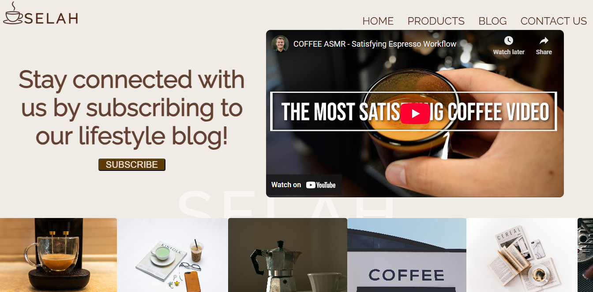

# Product Landing Page

This project is a **Product Landing Page** created as part of the [freeCodeCamp Responsive Web Design Certification](https://www.freecodecamp.org/learn/2022/responsive-web-design/).

## 📋 Project Description

A clean, modern, and responsive **Product Landing Page** built using HTML and CSS. This project showcases a multi-section website including a hero section, product showcase, video embed, blog, contact form, and footer — all styled for desktop and mobile screens.

## 🧠 Skills Demonstrated

- **Responsive Web Design**  
  Uses `media queries`, `clamp()`, and flexible units to ensure accessibility on all screen sizes.

- **Modern CSS Layouts**  
  Built entirely with **Flexbox**, enabling adaptable and structured layout designs.

- **Interactive UI Design**  
  - Hover effects on products and buttons  
  - Transitions and animations for user feedback  
  - Z-index layering and background image overlays

- **Form Design and Accessibility**  
  Custom-styled form inputs with semantic structuring for usability.

- **Typography and Visual Hierarchy**  
  Utilized Google Fonts and spacing techniques to guide user focus.

- **Mobile-first and Cross-browser Compatibility**  
  Ensured fluid rendering on both desktop and mobile devices.

## 🚀 Live Demo

[Click here to view the live project](https://moagi-t.github.io/product-landing-page/) 

## 📸 Screenshot

